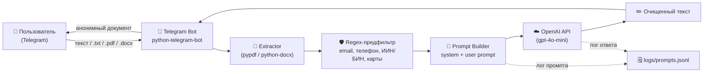

# Архитектура «Анонимайзер данных»

## Схема (для сдачи)

## Компоненты

| Слой | Файл | Что делает |
|------|------|-----------|
| Telegram I/O | `src/bot.py` | Принимает сообщения и документы, отдаёт ответ |
| Извлечение текста | `src/extractors.py` | Достаёт текст из `.txt`, `.pdf`, `.docx` |
| Regex-предфильтр | `src/anonymizer.py` (`regex_prefilter`) | Маскирует email, телефоны, ИИН, БИН, карты, IBAN |
| LLM-слой | `src/anonymizer.py` (`Anonymizer`) | Дочищает контекстные сущности (ФИО, адреса, даты рождения) |
| Промпты | `src/prompts.py` | System + user prompt с правилами замены |
| Конфигурация | `src/config.py` | Загрузка `.env` |
| Логи промптов | `logs/prompts.jsonl` | JSONL-лог: запрос, ответ, токены |

## Поток данных (по шагам)

1. Пользователь отправляет текст или файл в Telegram.
2. `bot.py` принимает апдейт и (если файл) вызывает `extractors.extract_text`.
3. `regex_prefilter` маскирует структурные ПД — это страхует от ошибок LLM
   и снижает счёт за токены.
4. `Prompt Builder` собирает `system_prompt` (правила) + `user_prompt` (текст
   между маркерами `<<<DOC>>>` / `<<<END>>>`).
5. Запрос уходит в OpenAI Chat Completions (`temperature=0` для воспроизводимости).
6. Ответ + метаданные (модель, токены) пишутся в `logs/prompts.jsonl`.
7. Бот возвращает анонимизированный текст пользователю (если длиннее 3500
   символов — кусками).

## Почему гибрид «regex + LLM»

| | Только regex | Только LLM | Гибрид |
|---|---|---|---|
| Телефоны/email/ИИН | ✅ 100% | ⚠️ может пропустить | ✅ |
| ФИО, адреса | ❌ | ✅ | ✅ |
| Стоимость | $0 | $$ | $ (меньше токенов после префильтра) |
| Воспроизводимость | ✅ | ⚠️ | ✅ |

## Этические/приватные риски

- **Утечка через провайдера LLM.** Текст уходит в OpenAI. В отчёте указать
  этот факт и оговорить, что для боевого использования нужна локальная LLM
  (Llama 3, Qwen) или контракт с провайдером с no-training-режимом.
- **Ложноотрицательные срабатывания.** LLM может пропустить редкое имя или
  казахскую транслитерацию. Поэтому regex-слой обязателен как страховка.
- **Reversibility.** Плейсхолдеры `[ИМЯ]` неуникальные — это by design:
  невозможно восстановить личность по выводу.
